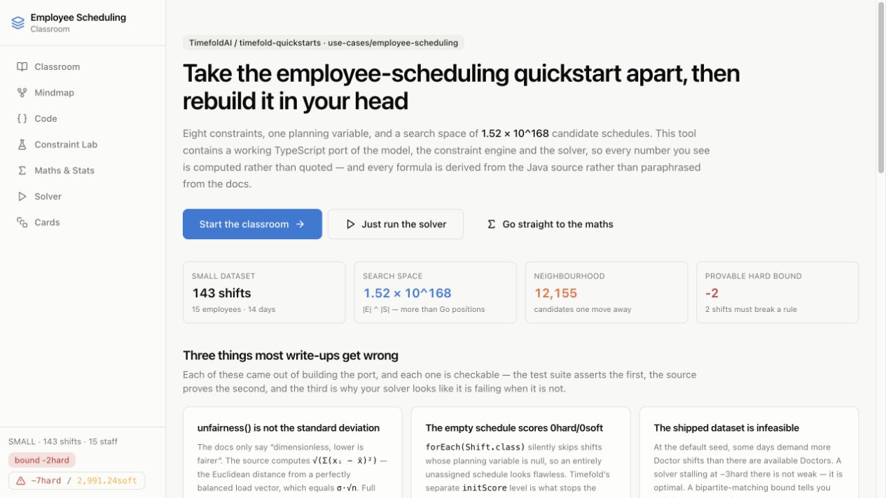
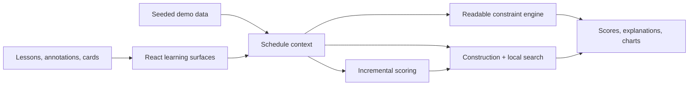

# Employee Scheduling Classroom

[](https://github.com/ArifMehmood16/employee-scheduling-classroom/actions/workflows/ci.yml)

An interactive, browser-based study tool for the [Timefold](https://timefold.ai)
employee-scheduling quickstart. Instead of presenting static documentation, it contains a
**working TypeScript port** of the domain model, constraint engine and solver. Every score,
bound and chart is computed locally, and the mathematical explanations are tied back to
the source.



## Highlights

- Eight executable hard/soft constraints with per-match justifications.
- A construction heuristic and local-search solver with four acceptors.
- A provable feasibility bound using Kuhn's bipartite-matching algorithm.
- An annotated Java source reader, codebase mind map and interactive constraint lab.
- Deterministic demo data and 28 engine tests, all running without a backend or API key.
- React 18.3, strict TypeScript, Vite 6, Tailwind 3.4 and shadcn/ui.

## Run it

```sh
npm ci
npm run dev        # http://localhost:8080
npm test           # 28 tests verifying the port
npm run typecheck
npm run lint
npm run build
```

Requires Node.js 20 or newer. No backend, API key or application server is needed; the
solver runs in the browser tab.

## Architecture



The readable constraint implementation is the reference. The faster incremental path is
tested against it over thousands of random states so optimisation cannot silently change
the scoring rules.

## What's here

| Route | What it does |
|---|---|
| `/learn` | Ten sequenced lessons, each with checkable outcomes and a checkpoint question |
| `/map` | Zoomable React Flow graph of the codebase, node by node |
| `/code` | The **verbatim Java** from the quickstart with 39 line-anchored annotations |
| `/lab` | Score a schedule, drag shifts between people, switch constraints off — a port of `PUT /schedules/analyze` |
| `/math` | Search-space combinatorics, lexicographic order, the unfairness derivation, Hall's-theorem bounds, live scoring benchmark |
| `/solve` | Real construction heuristic + local search with a move-by-move inspector and an acceptor race |
| `/cards` | 40 flashcards (three-box Leitner) and a 10-question quiz |

## The engine

`src/timefold/` is a faithful port, not a mock-up.

| File | Purpose |
|---|---|
| `domain.ts` | `Employee`, `Shift`, `EmployeeSchedule` — mirrors the annotated Java model, including `java.time` truncation semantics |
| `score.ts` | `HardSoftScore` with **lexicographic** comparison |
| `constraints.ts` | All 8 constraints with per-match justifications. The readable reference implementation |
| `fastEval.ts` | The same arithmetic, ~20× faster. Precomputation, hash sets, an early-break pair loop, zero hot-path allocation |
| `loadBalance.ts` | Port of `DefaultLoadBalance`, both direct and the real O(1) incremental accumulator |
| `solver.ts` | Construction heuristic + local search with 4 acceptors (Late Acceptance, Hill Climbing, Simulated Annealing, Tabu) |
| `feasibility.ts` | Kuhn's bipartite matching → a **provable lower bound** on the hard score |
| `searchSpace.ts` | Combinatorics in log10 space, because the honest numbers overflow float64 |
| `demoData.ts` | Port of `DemoDataGenerator` (SMALL / LARGE / TINY), seeded and reproducible |

`npm test` asserts that `constraints.ts` and the solver's incremental scoring agree with
each other over thousands of random states, and checks every constraint's arithmetic
against hand-computed cases. If the fast path and the readable path ever disagree, the
readable one is right by definition.

## Three findings from building it

**1. `unfairness()` is not the standard deviation.** The Javadoc only says
"dimensionless, lower is fairer". Reading `DefaultLoadBalance.java`, it accumulates
`Σxᵢ²` and `−S²` separately and returns `sqrt(numerator/n + integralPart)`, which by the
computational formula for variance is

```
unfairness = √(Σxᵢ² − S²/n) = √(Σ(xᵢ − x̄)²) = σ·√n
```

the Euclidean distance from the load vector to the perfectly balanced one. Full
derivation, with a live widget, at `/math` → Load balancing.

**2. An empty schedule scores a flawless 0hard/0soft.** `forEach(Shift.class)` silently
excludes entities whose planning variable is null, so no constraint matches anything.
Timefold's separate `initScore` level is what stops a solver latching onto it as the
optimum — the port replicates that, and `solver.ts` documents why a naive
"keep the best score" implementation throws away every real schedule it finds.

**3. The shipped `SMALL` dataset is infeasible.** At `randomSeed = 0`, some days demand
more `Doctor` shifts than there are available Doctors, so `0hard` is unreachable and a
solver stalling at `−3hard` is *optimal*, not weak. `feasibility.ts` computes the exact
shortfall by per-day bipartite matching (Hall's deficiency theorem), which is the
difference between debugging your solver and debugging your data.

## Notes on the port

- **Seeded RNG.** `mulberry32`, not `java.util.Random` — the *distributions* and structure
  are faithful, the exact names drawn are not identical to a Java run. Everything is
  reproducible for a given seed.
- **Start date is pinned** to `2026-08-10` (a Monday) rather than `new Date()`, so the
  feasibility bound and every displayed figure are stable.
- **Approximations are labelled in the code.** The construction heuristic approximates
  Timefold's `ALLOCATE_ENTITY_FROM_QUEUE`; the simulated-annealing acceptor collapses the
  two score levels into one magnitude where Timefold anneals each separately. Both are
  flagged where they occur rather than glossed over.
- **The solver runs on the main thread**, time-sliced from `requestAnimationFrame`. A Web
  Worker would be smoother but would hide the individual accept/reject decisions, which
  are the point of the move inspector.

## Charts

Chart colours were validated with a colour-vision-deficiency checker against the actual
render surfaces (worst adjacent CVD ΔE 8.4, normal-vision 19.8; all pass the lightness
band, chroma floor and 3:1 contrast checks). Hard/soft use the reserved *status* palette
and always ship with a text label, so hue never carries meaning alone. Hard and soft score
are plotted as **two charts, never one with two y-axes** — they are separate levels of a
lexicographic order, and a shared axis would invent a relationship that does not exist.

## Verification and known limits

- `npm test` covers the domain, every constraint, feasibility bounds, incremental scoring
  and solver behaviour with 28 deterministic tests.
- `npm run typecheck`, `npm run lint` and `npm run build` are the local quality gates.
- The solver is intentionally time-sliced on the main thread so moves remain inspectable.
- The production bundle is currently about 1.3 MB before gzip; route-level code splitting
  is the next meaningful performance improvement.
- This is an independent educational port, not an official Timefold product or a drop-in
  replacement for the Java solver.

## Source

Ported from `use-cases/employee-scheduling` in
[TimefoldAI/timefold-quickstarts](https://github.com/TimefoldAI/timefold-quickstarts).
Formula details cross-checked against
[TimefoldAI/timefold-solver](https://github.com/TimefoldAI/timefold-solver)
(`DefaultLoadBalance`, `LateAcceptanceAcceptor`, `AcceptorFactory`).

The embedded upstream Java excerpts are provided under Apache-2.0. See
[THIRD_PARTY_NOTICES.md](THIRD_PARTY_NOTICES.md) and the included licence copy. Original
project code is not offered under an open-source licence unless a file states otherwise.

## Development environment

The repository remains compatible with [Lovable](https://lovable.dev), but it is a normal
Vite project: the locked npm commands above are sufficient to build and test it locally.
